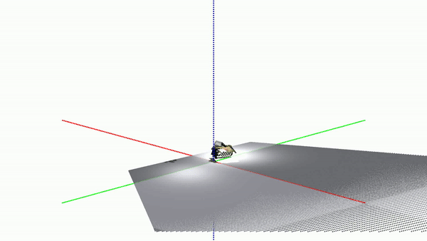

dexterity
=======

This document explains the environments and functionalities added to IsaacGymEnvs by dexterity.

Overview
--------
dexterity environments make use of the same underlying structure as the factory tasks. Specifically, dexterity uses an underlying [base](../isaacgymenvs/tasks/dexterity/base/base.py) class. [environment](../isaacgymenvs/tasks/dexterity/env/) classes (e.g. hammer) are derived from the base class to create different scenes. From each environment, multiple [tasks](../isaacgymenvs/tasks/dexterity/task/) can be created that specify the objective for this setting.

The tasks included so far are: **DexterityTaskBinPick**, **DexterityTaskDrillPickAndPlace**, **DexterityTaskHammerDriveNail**, and **DexterityTaskObjectLift**.

Assets and Robot Models
------

dexterity adds a variety of assets required for the tasks, as well as robot models and a new way of composing them. All robot models are specified as XML files. Instead of building separate models for each combination of robot arm and end-effector [DexterityXML](../isaacgymenvs/tasks/dexterity/xml/xml.py) provides functionalities to attach different models. Therefore, the desired robot is specified simply through the individual files, for example as:
```
robot: [ 'franka_emika_panda/panda.xml', 'schunk_sih/right_hand.xml', 'vive_tracker/tracker.xml']
```
in the [DexterityBase.yaml](../isaacgymenvs/cfg/task/DexterityBase.yaml) config file.

### Included Models
| Robot                                            | Preview                                                                         |
|--------------------------------------------------|---------------------------------------------------------------------------------|
| [UR5e](../assets/dexterity/ur5e)                 |                |
| [Panda](../assets/dexterity/franka_emika_panda)  |  |
| [KUKA Allegro](../assets/dexterity/kuka_allegro) |        |
| [Schunk SIH](../assets/dexterity/schunk_sih)     |          |
| [Shadow Hand](../assets/dexterity/shadow_hand)   |         |


Camera Sensors
------
dexterity enables the use of camera sensors and visual observations directly through the config files. Cameras can be added to an environment via the `cameras` keyword. Under the camera name, the pose and model, or detailed camera properties are specified.

### Example Camera
```yaml
cameras:
    frontview:
        model: 'realsense_d405'
        pos: [0.5, 0, 0.5]
        quat: [0, 0, 1, 0]
```

The camera will only be used, if it is actually included in a tasks observations of the task. Hence, any camera that might be of interest can be specified in the environment config, but will not be created and create overhead unless it is actually used in the task config.
```yaml
observations: ['ik_body_pos', 'ik_body_quat', 'frontview']
```

If `save_videos: True` is set in the `debug:` section of the [DexterityBase.yaml](../isaacgymenvs/cfg/task/DexterityBase.yaml) file, all camera observations will be written to mp4 file stored in a /videos subdirectory of the current run.

The canonical [vec_task.py](../isaacgymenvs/tasks/base/vec_task.py) class returns observation as a `dict`, where the *obs* key holds state-space observation. We add visual observations under a new *image* key and then separate the observations by the inidvidual cameras. So, the image of the camera in the example above can be found under `obs_dict["image"]["frontview"]`.


The available camera / image types are currently `'d'` (depth image), `'rgb'` (color image), `'rgbd'` (concatenated color and depth image), `'pc'` (point cloud generated from depth image), `'pc_rgb'` (colored point cloud generated from color and depth image), and `'pc_seg'` (point cloud with segmentation features for all points).

### Point clouds
Cameras of type `'pc'`, `'pc_rgb'`, or `'pc_seg'` will automatically output point cloud observations, like the ones shown below. We compensate for the offset of the view-matrices in Isaac Gym, such that all point cloud data is in the environment-specific coordinate systems.

| Camera transformation                        | Env 1                                                                                                   | Env 2                                                                                                   | Env 3                                                                                                   | Env 4                                                                                                   |
|----------------------------------------------|---------------------------------------------------------------------------------------------------------|---------------------------------------------------------------------------------------------------------|---------------------------------------------------------------------------------------------------------|---------------------------------------------------------------------------------------------------------|
| **static** <br/>frontview on the environment |   |   |   |   |
| **attached** <br/>camera mounted to the palm |  |  |  |  |

Teleoperation and Imitation Learning
------
dexterity provides an interface to teleoperate the Isaac Gym environments in virtual reality. Related code can be found in the [demo](../isaacgymenvs/tasks/dexterity/demo) directory. The teleoperation interface is restricted to specific hardware (Vive VR Headset and Tracker and SenseGlove) and can be used to operate any combination of the robot arm and hand models.

Log data with `self.log(dict)`
------
A simple logging interface is provided, whereby all classes derived from the 
[DexterityBase](../isaacgymenvs/tasks/dexterity/base/base.py) class are able to 
log information by calling `self.log(dict)`. All data is logged to the same 
tensorboard instance that rl-games is using.

### Example Usage
```python
self.log({"loss": 0.792384, 
          "action_norm": np.linalg.norm(actions_np)}
```

Tune Hyperparameters with W&B Sweeps
------
The basic training interface of 
[IsaacGymEnvs](https://github.com/NVIDIA-Omniverse/IsaacGymEnvs) is compatible 
with [W&B Sweeps](https://wandb.ai/site/sweeps). An example of how a sweep 
configuration for dexterity can be set up is shown below.

### Example Configuration

```yaml
command:
  - ${env}
  - python
  - ${program}
  - ${args_no_hyphens}  # for compatibility with hydra's command line interface
program: train.py
method: random  # method for choosing the next hparam configuration ['grid', 'random', 'bayes']

parameters:
  ###### set fixed parameters ######
  wandb_activate:
    value: True  # runs that the sweep starts should always be logged to wandb
  task:
    value: DexterityTaskObjectLift
  experiment:
    value: dexterity_test_sweep
  headless: 
    value: False  # headless should be set to False when the capture_video function is being used and should be True otherwise
  max_iterations:
    value: 1024  # number of epochs to train for
  seed:
    distribution: int_uniform  # choose a random seed for each run
    max: 1000000
    min: 1
  capture_video:
    value: True  # whether to periodically capture videos
  capture_video_freq:
    value: 524288
  capture_video_len:
    value: 450
  force_render:
    value: False

  ###### tune reward parameters ######
  task.rl.reward.action_penalty:
    distribution: log_uniform
    min: -5
    max: 2
  task.rl.reward.fingertips_dist_penalty:
    distribution: log_uniform
    min: -5
    max: 2
  task.rl.reward.object_lift_off_reward: 
    distribution: log_uniform
    min: -5
    max: 2
  task.rl.reward.success_bonus:
    distribution: log_uniform
    min: 4
    max: 9
  task.rl.lift_off_height:
    distribution: uniform
    min: 0.025
    max: 0.2

  task.rl.target_height:
    distribution: uniform
    min: 0.05
    max: 0.4

  ###### tune training parameters ######
  train.params.config.learning_rate:
    distribution: log_uniform
    min: -9
    max: -6

  ###### tune observation-space ######
  task.env.observations:
    distribution: categorical
    values:
      - - ik_body_pos
        - ik_body_quat
        - object_pos
      - - ik_body_pos
        - ik_body_quat
        - object_pos
        - object_quat
      - - ik_body_pos
        - ik_body_quat
        - object_pos
        - object_quat
        - fingertips_pos
      - - ik_body_pos
        - ik_body_quat
        - object_pos
        - object_quat
        - fingertips_pos
        - fingertips_quat
```

Contact and Citation
------
dexterity is developed by [Malte Mosbach](https://maltemosbach.github.io/).
